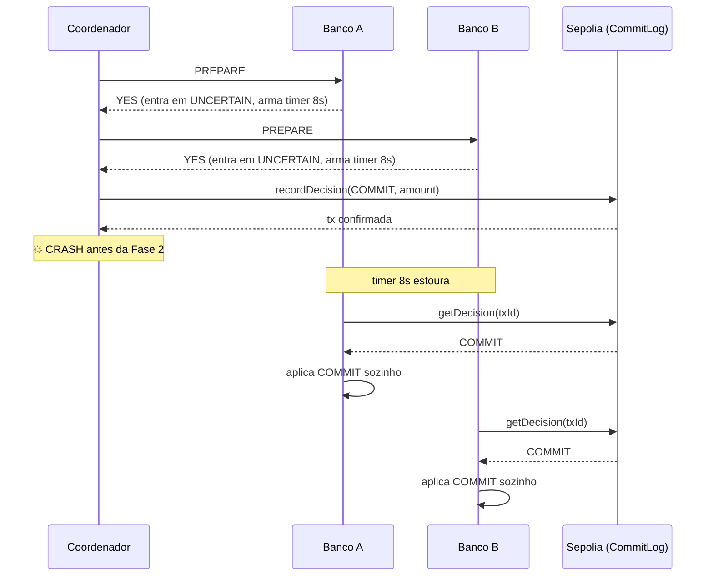

# Lab 2PC + Sepolia — extensão

Extensão sobre o lab original do prof. Repositório separado em duas camadas:

- **`v1-prof-original`** (tag git) — código fiel ao roteiro, sem alteração nenhuma.
- **`main`** — base do prof + extensões descritas abaixo.

```bash
git diff v1-prof-original..main
```
…mostra exatamente o que mudou.

---

## O que foi adicionado

| # | Item | Por quê |
|---|---|---|
| 1 | Campo `amount` no `CommitLog.sol` (struct + event + função) | Pedido explícito do enunciado de revisão. Habilita também a recuperação local do valor durante crash-recovery. |
| 2 | **Crash-recovery do coordenador via blockchain** | Ataca o problema clássico do 2PC bloqueante. Sem isso, os bancos travam quando o coordenador morre. |
| 3 | Cenários como flag (`--scenario=happy\|abort\|crash`) | Substitui "edita `amount=150` no código pra testar ABORT". |
| 4 | `scripts/deploy.js` | Faz `forge script` e atualiza `CONTRACT_ADDRESS` no `.env` automaticamente. |
| 5 | `audit.js` | Açúcar em cima do `cast call records(...)` — formata a leitura on-chain. |
| 6 | `participant.js` | Lógica compartilhada de Banco A/B (DRY). `bankA.js` e `bankB.js` viraram wrappers de 8 linhas. |

---

## Como rodar

### Setup (1 vez)
```bash
cp .env.example .env       # preencha SEPOLIA_RPC_URL e PRIVATE_KEY
npm install
npm run deploy             # compila, deploya na Sepolia e atualiza .env
```

### Execução — 3 terminais

| Terminal | Comando |
|---|---|
| 1 | `npm run bank:a` |
| 2 | `npm run bank:b` |
| 3 | `npm run scenario:happy` &nbsp;⟶&nbsp; ou `:abort` &nbsp;ou&nbsp; `:crash` |

Os scripts usam `--slow=1200` (1.2s entre fases) por padrão, pra dar pra acompanhar a execução em tempo real.

### Auditoria
```bash
npm run audit -- tx-1778960697780
```
```
─── Auditoria on-chain ──────────────────────────────
Transaction ID:  tx-1778960697780
Decision:        COMMIT
Amount:          50
Timestamp:       2026-05-16 19:45:12 UTC
Coordinator:     0xdA83...0354
Contract:        0x9c21...a95a
─────────────────────────────────────────────────────
```

---

## Cenário CRASH — o coração da extensão



**A blockchain deixa de ser apenas auditoria e vira oráculo de decisão.** É o que justifica integrar 2PC com smart contract em primeiro lugar — qualquer banco de dados serviria pra log de auditoria; só a imutabilidade e a disponibilidade independente da Sepolia permitem que os participantes resolvam o estado sem o coordenador.

---

## Decisões técnicas

**Ordem dos passos no coordenador: grava on-chain *antes* do broadcast da Fase 2.**
Se invertido, o crash entre broadcast e gravação deixaria os bancos commitados localmente mas sem registro imutável — perdendo a propriedade que a blockchain estava lá pra dar. Gravar primeiro garante que o registro on-chain é o "ponto de verdade" — qualquer um (banco, auditor) pode consultar e descobrir a decisão final.

**Política de timeout: retentativas com presumed-abort após N tentativas.**
Quando o timer estoura e o contrato responde `UNKNOWN`, o banco não pode decidir unilateralmente. Pode ser que (a) o coordenador morreu antes de gravar — abort é seguro — ou (b) o coordenador está só atrasado. O banco retenta 3 vezes a cada 8s. Só após o esgotamento adota *presumed abort*. Esse é um trade-off conhecido entre disponibilidade e consistência; em produção, o intervalo seria maior e talvez houvesse um terceiro mecanismo (ex.: heartbeat do coordenador). No lab, 3×8s basta pra ilustrar o problema.

**Bancos consultam o contrato em modo read-only (sem `PRIVATE_KEY`).**
A única conta que escreve on-chain é o coordenador. Os bancos só leem — então não precisam de carteira nem gas. Isso reforça o modelo: a blockchain é fonte de verdade compartilhada, não um endpoint de escrita pra todo mundo.

**Cenário `crash` é "crash depois de gravar".**
Existem dois pontos de crash possíveis no coordenador: antes da gravação on-chain (bancos vão para *presumed abort* eventualmente) e depois (bancos descobrem a decisão e completam). Escolhi o segundo como cenário default porque demonstra o uso *positivo* da blockchain — recovery construtivo, não só prevenção de inconsistência.

---

## Estrutura

```
lab-2pc-foundry/
├── src/CommitLog.sol            # contrato, agora com `amount`
├── script/DeployCommitLog.s.sol # deploy script Foundry
├── scripts/deploy.js            # wrapper Node: forge script + update .env
├── participant.js               # lógica compartilhada dos bancos
├── bankA.js                     # wrapper: saldo 100, debita no COMMIT
├── bankB.js                     # wrapper: saldo 20, credita no COMMIT
├── coordinator.js               # 2PC + flags --scenario / --slow
├── audit.js                     # consulta on-chain formatada
├── foundry.toml
└── package.json                 # scripts: deploy, bank:a, bank:b, scenario:*, audit
```

---

## Pré-requisitos

- Node.js 20+ (testado com 25.8.1)
- Foundry (`forge`, `cast`) — https://book.getfoundry.sh/
- Carteira com ETH na Sepolia (faucet: https://www.alchemy.com/faucets/ethereum-sepolia)

---

## Artefatos das execuções (deste run)

| Cenário | Transaction ID | Hash Sepolia | Decisão |
|---|---|---|---|
| happy | `tx-1778960568762` | `0x6ec81a36…b63b3e` | COMMIT |
| abort | `tx-1778960630731` | `0xffe4df11…4325da` | ABORT |
| crash | `tx-1778960697780` | `0xd311569b…b4406c` | COMMIT (recovery) |

**Contrato:** `0x9c21cD793B4a4de95f86Ab98628F5FAb5C61a95a`
**Explorer:** https://sepolia.etherscan.io/address/0x9c21cD793B4a4de95f86Ab98628F5FAb5C61a95a
